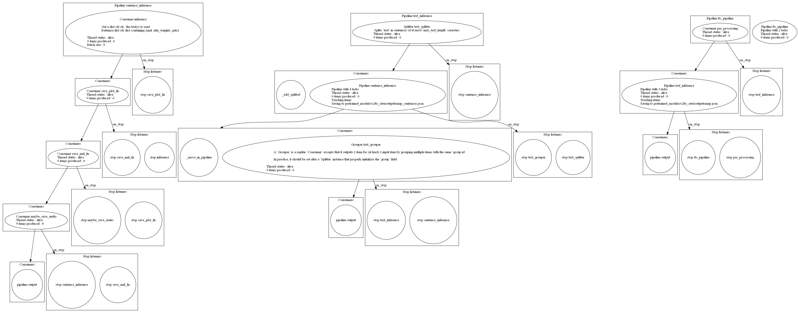

# :yum: Text To Speech (TTS)

**WARNING : models' weights have been modified as the architecture has been cleaned up and optimized. Make sure to re-upload the pretrained weights or contact me if you have trained custom models, I can send you the code to update their checkpoint !** :smile:

## Project structure

```bash

├── custom_architectures
│   ├── tacotron2_arch.py
│   └── waveglow_arch.py
├── custom_layers
├── custom_train_objects
│   ├── losses
│   │   └── tacotron_loss.py    : custom Tacotron2 loss
├── datasets
├── example_outputs         : some pre-computed audios to show you an example
├── hparams
├── loggers
├── models
│   ├── siamese             : the `AudioSiamese` is used as encoder for the SV2TTS model
│   ├── tts
│   │   ├── sv2tts_tacotron2.py : SV2TTS main class
│   │   ├── tacotron2.py        : Tacotron2 main class
│   │   ├── vocoder.py          : main functions for complete inference
│   │   └── waveglow.py         : WaveGlow main class (both pytorch and tensorflow)
├── pretrained_models
├── unitest
├── utils
├── example_fine_tuning.ipynb
├── example_sv2tts.ipynb
├── example_tacotron2.ipynb
├── example_waveglow.ipynb
└── text_to_speech.ipynb
```

Check [the main project](https://github.com/yui-mhcp/base_dl_project) for more information about the unextended modules / structure / main classes. 

\* Check my [Siamese Networks project](https://github.com/yui-mhcp/siamese_networks) for more information about the `models/siamese` module

Note that some parts of the training notebooks may not properly work as they are quite old but the main training scripts should work properly as well as the `speech_to_text` notebook. 

## Available features

- **Text-To-Speech** (module `models.tts`) :

| Feature   | Fuction / class   | Description |
| :-------- | :---------------- | :---------- |
| Text-To-Speech    | `tts`             | perform TTS on text you want with the model you want  |
| stream            | `tts_stream`      | perform TTS on text you enter |
| TTS logger        | `loggers.TTSLogger`   | converts `logging` logs to voice and play it |

You can check the `text_to_speech` notebook for a concrete demonstration

## Available models

### Model architectures

Available architectures : 
- `Synthesizer` :
    - [Tacotron2](https://arxiv.org/abs/1712.05884) with extensions for multi-speaker (by ID or `SV2TTS`)
    - [SV2TTS](https://papers.nips.cc/paper/2018/file/6832a7b24bc06775d02b7406880b93fc-Paper.pdf) extension of the Tacotron2 architecture for multi-speaker based on speaker's embeddings\*
- `Vocoder` :
    - [Waveglow](https://arxiv.org/abs/1811.00002)

\* The speaker's embeddings are created with the Siamese Networks approach, which differs from the original paper. Check the [Siamese Networks](https://github.com/yui-mhcp/siamese_networks) project for more information on this architecture.

My SV2TTS models are fine-tuned from pretrained Tacotron2 models which speeds up a lot the training.

### Model weights

| Name      | Language  | Dataset   | Synthesizer   | Vocoder   | Speaker Encoder   | Trainer   | Weights   |
| :-------: | :-------: | :-------: | :-----------: | :-------: | :---------------: | :-------: | :-------: |
| pretrained_tacotron2  | `en`      | [LJSpeech](https://keithito.com/LJ-Speech-Dataset/)   | `Tacotron2`   | `WaveGlow`    | / | [NVIDIA](https://github.com/NVIDIA)   | [Google Drive](https://drive.google.com/file/d/1mnhPgOE8IrQ3cTtfwOScZEn3aFZvaZG7/view?usp=sharing)  |
| tacotron2_siwis   | `fr`      | [SIWIS](https://datashare.ed.ac.uk/handle/10283/2353?show=full)   | `Tacotron2`   | `WaveGlow`    | / | [me](https://github.com/yui-mhcp) | [Google Drive](https://drive.google.com/file/d/1r3Dzu5V1A34-StUeKPt0Fl_RoQohu8t_/view?usp=sharing)  |
| sv2tts_tacotron2_256  | `fr`      | [SIWIS](https://datashare.ed.ac.uk/handle/10283/2353?show=full), [VoxForge](http://www.voxforge.org/), [CommonVoice](https://commonvoice.mozilla.org/fr/datasets)   | `SV2TTSTacotron2`   | `WaveGlow`    | [Google Drive](https://drive.google.com/file/d/1-WWfmQs7pGRQpcZPI6mn9c4FTWnrHZem/view?usp=sharing) | [me](https://github.com/yui-mhcp)  | [Google Drive](https://drive.google.com/file/d/1at9bYsAoazqMccDBXW089DjivMS1Nb2x/view?usp=sharing)  |
| sv2tts_siwis  | `fr`      | [SIWIS](https://datashare.ed.ac.uk/handle/10283/2353?show=full), [VoxForge](http://www.voxforge.org/), [CommonVoice](https://commonvoice.mozilla.org/fr/datasets)   | `SV2TTSTacotron2`   | `WaveGlow`    | [Google Drive](https://drive.google.com/file/d/1-WWfmQs7pGRQpcZPI6mn9c4FTWnrHZem/view?usp=sharing) | [me](https://github.com/yui-mhcp)  | [Google Drive](https://drive.google.com/file/d/1GESyvKozvWEj7nfC7Qin2xuMJrL4pqTS/view?usp=sharing)  |

You can download the `tensorflow` version of `WaveGlow` at [this link](https://drive.google.com/file/d/1Lx-MiiRuxWmBX4_ZORD9YT4LfgHb0Tfk/view?usp=sharing)

Models must be unzipped in the `pretrained_models/` directory !

**Important Note** : the `NVIDIA` models available on `torch hub` requires a compatible GPU with the correct configuration for `pytorch`. It is the reason why I have released pre-converted models (both `Tacotron2` and `WaveGlow`) in `tensorflow` if you do not want to configure `pytorch` ! :smile:

The `sv2tts_siwis` is a fine-tuned version of `sv2tts_tacotron2_256` on the `SIWIS` (single-speaker) dataset. Fine-tuning a multi-speaker on a single-speaker dataset tends to improve the stability and produce a voice with more intonation. 

## Usage and demonstration

### Demonstration

You can find a demonstration on [this link](https://colab.research.google.com/drive/18odkKiBl8sm4Ba9S3TM1V128uO9HbDn0?usp=sharing) running on [Google Colab](https://colab.research.google.com/)

You can also find some audio generated in `example_outputs/` or directly in the notebooks.

### Installation and usage

1. Clone this repository : `git clone https://github.com/yui-mhcp/text_to_speech.git`
2. Go to the root of this repository : `cd text_to_speech`
3. Install requirements : `pip install -r requirements.txt`
4. Open `text_to_speech` notebook and follow the instruction !

You also have to install `ffmpeg` for audio loading / saving.

## TO-DO list :

- [x] Make the TO-DO list
- [x] Comment the code
- [x] Add pretrained weights for French
- [x] Make a `Google Colab` demonstration
- [x] Implement WaveGlow in `tensorflow 2.x`
- [x] Add `batch_size` support for `vocoder inference`
- [x] Add pretrained `SV2TTS` weights
- [x] Add a `similarity loss` to test a new training procedure for single-speaker fine-tuning
- [ ] Add document parsing to perform `TTS` on document (in progress)
- [ ] Add new languages support
- [ ] Add new TTS architectures / models
- [x] Add `consumer-producer` based support for prediction
- [x] Add pipeline-based prediction
- [ ] Train a `SV2TTS` model based on an encoder trained with the `GE2E` loss

## Pipeline-based prediction

The `Tacotron2` model (as well as the vocoder inference) supports the pipeline-based prediction, meaning that all the tasks you see in the below graph are multi-threaded. Check the [data_processing project](https://github.com/yui-mhcp/data_processing) for a better understanding of the `producer-consumer` framework. 



## Multi-speaker Text-To-Speech

There exists 2 main ways to enable `multi-speaker` in the `Tacotron2` architecture :
1. Use a `speaker-id`, embed it with an `Embedding` layer and concat / add it to the `Encoder` output
2. Use a `Speaker Encoder (SE)` to embed audio from speakers and concat / add this embedding to the `encoder output`

I did not test the 1st idea but it is available in my implementation.

### Automatic voice cloning with the `SV2TTS` architecture

Note : in the next paragraphs, `encoder` refers to the `Tacotron Encoder` part while `SE` refers to a `speaker encoder` model (detailed below)

#### The basic intuition

The `Speaker Encoder Text-To-Speech` comes from the [From Speaker Verification To Text-To-Speech (SV2TTS)](https://papers.nips.cc/paper/2018/file/6832a7b24bc06775d02b7406880b93fc-Paper.pdf) paper which shows how to use a `Speaker Verification` model to embed audio and use them as input for a `Tacotron2` model

The idea is the following : 
1. Train a model to identify speakers based on their audio : the `speaker verification` model. This model basically takes as input an audio sample (5-10 sec) from a speaker, embed it and compare it to baseline embeddings to decide whether the speakers are the same or not
2. It uses the `speaker encoder` model to produce embeddings of the speaker to clone
3. It makes a classical `text encoding` with the `Tacotron Encoder` part
4. It concatenates the `speaker embedding` (1D vector) to each frame of the `encoder output`\*
5. It makes a classical forward pass with the `Tacotron Decoder` part

The idea is that the `Decoder` will learn to use the `speaker embedding` to copy its prosody / intonation / ... to read the text with the voice of this speaker : it works quite well !

\* The `embedding` is a 1D vector while the `encoder output` is a matrix with shape `(text_length, encoder_embedding_dim)`. The idea is to concatenate the `embedding` to each frame by repeating it `text_length` times

#### Problems and solutions

However there are some problems with this approach : 
- A perfect generalization to new speakers is really hard because it requires datasets with many speakers (more than 1k) which is really rare in `Text-To-Speech` datasets
- The audio should be good quality to avoid creating noise in the output voices
- The `Speaker Encoder` must be good enough to well separate speakers
- The `Speaker Encoder` must be able to embed speakers in a relevant way so that the `Tacotron` model can extract useful information on the speaker's prosody

For the 1st problem, there is no real solution except combining different datasets as I did with the `CommonVoice`, `VoxForge` and `SIWIS` datasets

Another solution is to train a good quality model and fine-tune it with a small amount of data on a particular speaker. The big advantage of this approach is that you can train a new model really fast with less than 20min of audio from the speaker (which is impossible with a classical single-speaker model training).

For the second point, pay attention to have good quality audio : my experiments have shown that with the original datasets (which are quite poor quality), the model *never* learned anything

However there exists a solution : preprocessing ! My `utils/audio` folder has many powerful preprocessing functions for `noise reduction` (using the [noisereduce](https://pypi.org/project/noisereduce/) library) and `audio silence trimming` (which is really important for the model)

For the 2 last points, read the next section on `speaker encoder`

#### The Speaker Encoder (SE)

The SE part must be able to differentiate speakers and embed them in a meaningful way. 

The model used in the paper is a 3-layer `LSTM` model with a normalization layer and trained with the [GE2E](https://ieeexplore.ieee.org/abstract/document/8462665) loss. The problem is that training this model is **really slow** and took 2 weeks on 4 GPU's in the CorentinJ master thesis (cf his [github](https://github.com/CorentinJ/Real-Time-Voice-Cloning))

This idea was not possible for me (because I do not have 4 GPU's :smile: ) so I tried something else : use my [AudioSiamese](https://github.com/yui-mhcp/siamese_networks) model ! Indeed, the objective of this model is to create speakers' embeddings and try to minimize distance between embeddings from a same speaker so, why not !

My experiments have shown 2 interesting results : 
1. An `AudioSiamese` trained on raw audio is quite good for `speaker verification` but embeds in a non-meaningful way for `Tacotron` so the result were quite poor
2. An `AudioSiamese` trained on mel-spectrogram (same parameters as the `Tacotron mel function`) is as good for `speaker verification` but seems to extract more meaningful information !

The big advantage is that in less than 1 training night you can have your `Speaker Encoder` and use it which is crazy : 1 night on single GPU instead of 2 weeks on 4 GPU's !

Furthermore in a visual comparison of embeddings made by the `3-layer LSTM` encoder and my `Siamese Network` encoder, they seem really similar


## The *partial* Transfer Learning procedure

In order to avoid training a SV2TTS model from scratch which would be completely impossible on a single GPU, I created a `partial transfer learning` code

The idea is quite simple : make transfer learning between models that have the same number of layers but different shapes\*. This allowed me to use my single-speaker pretrained model as base for the SV2TTS model ! Experiments showed that it works pretty well : the model has to learn new neurons specific to voice cloning but can reuse its pretrained-neurons for speaking, quite funny !

Some ideas that showed some benefits (especially for single-speaker fine-tuning) : 
- After some epochs (2-5) we can put the `Postnet` part as non-trainable : this part basically improves mel-quality but is not speaker-specific so no need to train it too much
- After some epochs (5-10) you can put the `Tacotron Encoder` part non trainable (only if your pretrained model was for the same language) : text-encoding is not speaker-specific so no need to train it too much

The idea behind these tricks is that the only *speaker-specific* part is the `DecoderCell` so we can make other parts non-trainable to force it to learn this specific part

\* Note that I also implemented it when models do not have the same number of layers

## Contacts and licence

You can contact [me](https://github.com/yui-mhcp) at yui-mhcp@tutanota.com or on [discord](https://discord.com) at `yui#0732`

The objective of these projects is to facilitate the development and deployment of useful application using Deep Learning for solving real-world problems and helping people. 
For this purpose, all the code is under the [Affero GPL (AGPL) v3 licence](LICENCE)

All my projects are "free software", meaning that you can use, modify, deploy and distribute them on a free basis, in compliance with the Licence. They are not in the public domain and are copyrighted, there exist some conditions on the distribution but their objective is to make sure that everyone is able to use and share any modified version of these projects. 

Furthermore, if you want to use any project in a closed-source project, or in a commercial project, you will need to obtain another Licence. Please contact me for more information. 

For my protection, it is important to note that all projects are available on an "As Is" basis, without any warranties or conditions of any kind, either explicit or implied. However, do not hesitate to report issues on the repository's project or make a Pull Request to solve it :smile: 

If you use this project in your work, please add this citation to give it more visibility ! :yum:

```
@misc{yui-mhcp
    author  = {yui},
    title   = {A Deep Learning projects centralization},
    year    = {2021},
    publisher   = {GitHub},
    howpublished    = {\url{https://github.com/yui-mhcp}}
}
```

## Notes and references

The code for this project is a mixture of multiple GitHub projects to have a fully modulable `Tacotron-2` implementation
- [1] [NVIDIA's repository (tacotron2 / waveglow)](https://github.com/NVIDIA) : this was my first implementation where I copied their architecture in order to reuse their pretrained model in a `tensorflow 2.x` implementation. 
- [2] [The TFTTS project](https://github.com/TensorSpeech/TensorflowTTS) : my 1st model was quite slow and had many `Out Of Memory (OOM)` errors so I improved the implementation by using the `TacotronDecoder` from this github which allows the `swap_memory` argument by using `dynamic_decode`
- [3] [Tensorflow Addons](https://github.com/tensorflow/addons) : as I had some trouble to use the library due to version issues, I copied just the `dynamic_decode()` with `BaseDecoder` class to use it in the `TacotronDecoder` implementation
- [4] [CorentinJ's Real-Time Voice cloning project](https://github.com/CorentinJ/Real-Time-Voice-Cloning) : this repository is an implementation of the `SV2TTS` architecture. I do not copy any of its code as I already had my own implementation (which is slightly different for this repo) but it inspired me to add the `SV2TTS` feature to my class. 

Papers : 
- [5] [Tacotron 2](https://arxiv.org/abs/1712.05884) : the original Tacotron2 paper
- [6] [Waveglow](https://arxiv.org/abs/1811.00002) : the WaveGlow model
- [7] [Transfer learning from Speaker Verification to Text-To-Speech](https://papers.nips.cc/paper/2018/file/6832a7b24bc06775d02b7406880b93fc-Paper.pdf)) : original paper for SV2TTS idea
- [8] [Generalized End-to-End loss for Speaker Verification](https://ieeexplore.ieee.org/abstract/document/8462665) : the GE2E Loss paper
